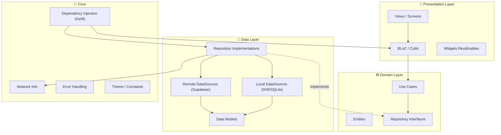
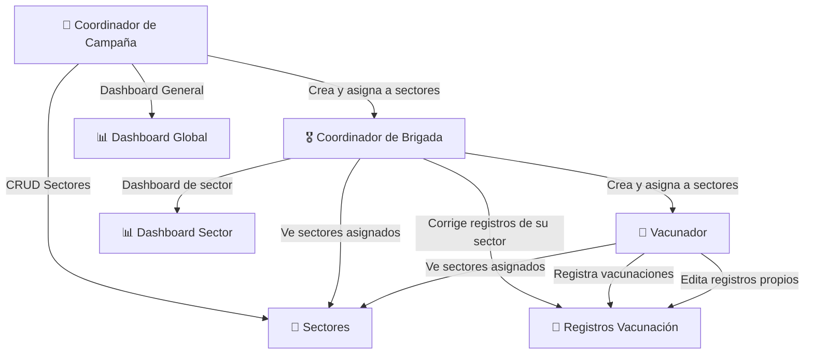
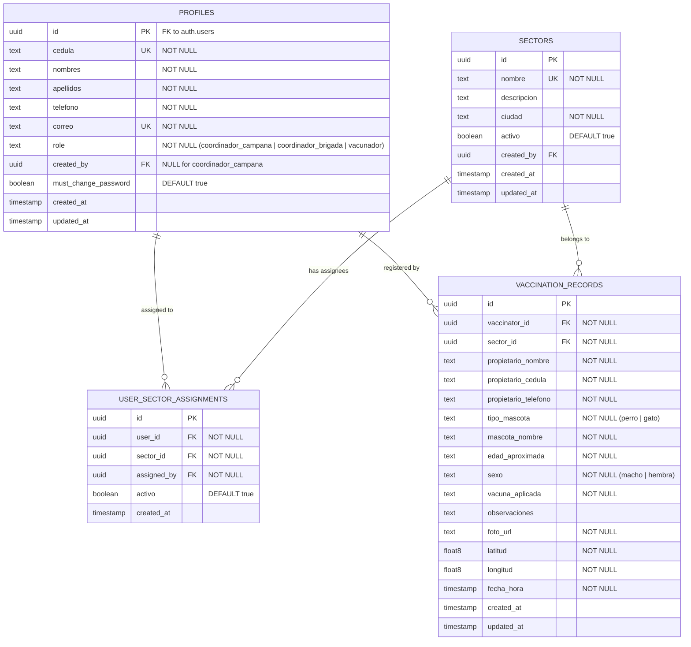
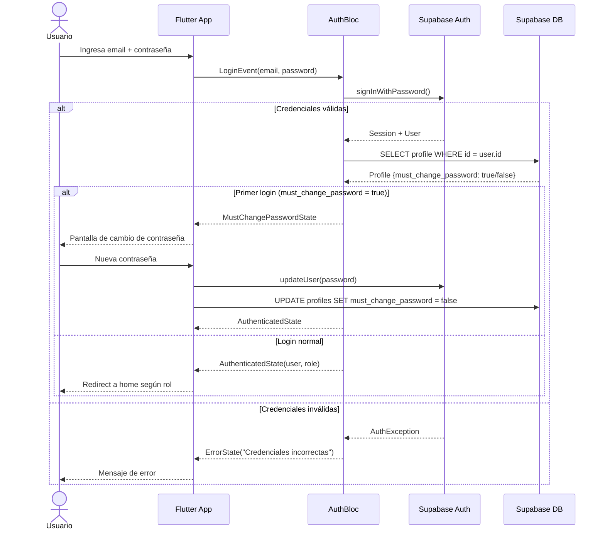
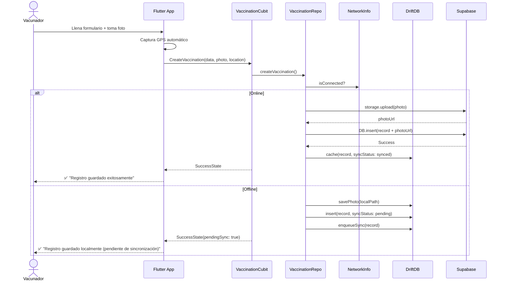
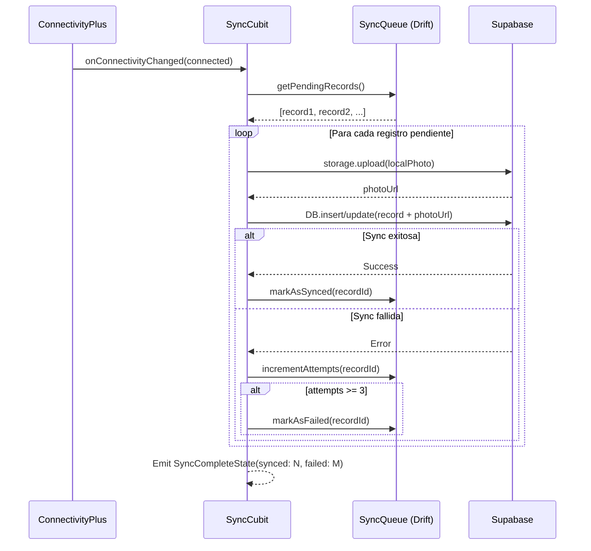

# VacunApp — Plan de Implementación Completo (Revisión Final)

Aplicación móvil Flutter para gestión de campañas de vacunación de perros y gatos en sectores de una ciudad, con backend Supabase (Auth, Database, Storage), arquitectura limpia (Clean Architecture), patrón de responsabilidad única (SRP), soporte offline-first y sincronización automática.

---

## Decisiones Confirmadas

| Decisión | Valor |
|----------|-------|
| **Ciudad** | Quito |
| **Plataforma** | Android |
| **State Management** | flutter_bloc (Cubit/BLoC) |
| **Base de datos local** | Drift (SQLite) |
| **Supabase** | Proyecto ya existente (el usuario proveerá URL + anon key) |
| **Diseño UI/UX** | Minimalista-moderno con paleta de colores neutros |
| **Barrios precargados** | 20-25 barrios de Quito |

---

## Arquitectura General

### Diagrama de Capas (Clean Architecture)



### Diagrama de Roles y Permisos



---

## Estructura de Carpetas del Proyecto

```text
lib/
├── main.dart                              # Entry point
├── app.dart                               # MaterialApp configuration
├── injection_container.dart               # GetIt DI setup (Singleton)
│
├── core/
│   ├── constants/
│   │   ├── app_constants.dart             # Constantes globales (default password, etc.)
│   │   ├── supabase_constants.dart        # Table names, bucket names
│   │   └── route_constants.dart           # Named routes
│   ├── enums/
│   │   ├── user_role.dart                 # Enum: coordinadorCampana, coordinadorBrigada, vacunador
│   │   ├── pet_type.dart                  # Enum: perro, gato
│   │   ├── pet_sex.dart                   # Enum: macho, hembra
│   │   └── sync_status.dart              # Enum: pending, synced, failed
│   ├── errors/
│   │   ├── exceptions.dart                # Custom exceptions (ServerException, CacheException, etc.)
│   │   └── failures.dart                  # Failure classes for Either pattern
│   ├── network/
│   │   ├── network_info.dart              # Abstract + Implementation (connectivity_plus)
│   │   └── supabase_client_manager.dart   # Singleton for Supabase client
│   ├── usecases/
│   │   └── usecase.dart                   # Base UseCase<Type, Params> abstract class
│   ├── theme/
│   │   ├── app_theme.dart                 # ThemeData (light/dark)
│   │   ├── app_colors.dart                # Color palette
│   │   └── app_text_styles.dart           # Typography
│   ├── utils/
│   │   ├── input_validators.dart          # Cédula, email, phone validators
│   │   ├── date_formatter.dart            # Date/time formatting
│   │   └── location_helper.dart           # GPS utilities
│   └── widgets/
│       ├── loading_widget.dart            # Reusable loading indicator
│       ├── error_widget.dart              # Reusable error display
│       ├── empty_widget.dart              # Empty state widget
│       ├── custom_text_field.dart          # Styled text field
│       ├── custom_button.dart             # Styled button
│       ├── role_badge.dart                # Role badge widget
│       └── photo_picker_widget.dart       # Camera/gallery picker
│
├── features/
│   ├── auth/
│   │   ├── data/
│   │   │   ├── datasources/
│   │   │   │   ├── auth_remote_datasource.dart      # Supabase Auth API calls
│   │   │   │   └── auth_local_datasource.dart       # SharedPreferences / Secure Storage
│   │   │   ├── models/
│   │   │   │   └── user_model.dart                  # UserModel extends UserEntity (toJson/fromJson)
│   │   │   └── repositories/
│   │   │       └── auth_repository_impl.dart        # Implements AuthRepository
│   │   ├── domain/
│   │   │   ├── entities/
│   │   │   │   └── user_entity.dart                 # Pure user entity
│   │   │   ├── repositories/
│   │   │   │   └── auth_repository.dart             # Abstract repository interface
│   │   │   └── usecases/
│   │   │       ├── login_usecase.dart                # Single responsibility: login
│   │   │       ├── logout_usecase.dart               # Single responsibility: logout
│   │   │       ├── check_first_login_usecase.dart    # Check if must change password
│   │   │       ├── change_password_usecase.dart      # Change password
│   │   │       ├── reset_password_usecase.dart       # Send reset email
│   │   │       └── get_current_user_usecase.dart     # Get authenticated user
│   │   └── presentation/
│   │       ├── bloc/
│   │       │   ├── auth_bloc.dart                    # Auth state management
│   │       │   ├── auth_event.dart
│   │       │   └── auth_state.dart
│   │       └── pages/
│   │           ├── login_page.dart
│   │           ├── change_password_page.dart
│   │           └── forgot_password_page.dart
│   │
│   ├── sectors/
│   │   ├── data/
│   │   │   ├── datasources/
│   │   │   │   ├── sector_remote_datasource.dart
│   │   │   │   └── sector_local_datasource.dart     # Drift DAO
│   │   │   ├── models/
│   │   │   │   └── sector_model.dart
│   │   │   └── repositories/
│   │   │       └── sector_repository_impl.dart
│   │   ├── domain/
│   │   │   ├── entities/
│   │   │   │   └── sector_entity.dart
│   │   │   ├── repositories/
│   │   │   │   └── sector_repository.dart
│   │   │   └── usecases/
│   │   │       ├── get_sectors_usecase.dart
│   │   │       ├── create_sector_usecase.dart
│   │   │       ├── update_sector_usecase.dart
│   │   │       └── delete_sector_usecase.dart
│   │   └── presentation/
│   │       ├── bloc/
│   │       │   └── sector_cubit.dart                # Cubit para sectores
│   │       └── pages/
│   │           ├── sectors_list_page.dart
│   │           └── sector_form_page.dart
│   │
│   ├── users_management/
│   │   ├── data/
│   │   │   ├── datasources/
│   │   │   │   ├── user_mgmt_remote_datasource.dart # Supabase: create user, assign sector
│   │   │   │   └── user_mgmt_local_datasource.dart
│   │   │   ├── models/
│   │   │   │   └── managed_user_model.dart
│   │   │   └── repositories/
│   │   │       └── user_mgmt_repository_impl.dart
│   │   ├── domain/
│   │   │   ├── entities/
│   │   │   │   └── managed_user_entity.dart
│   │   │   ├── repositories/
│   │   │   │   └── user_mgmt_repository.dart
│   │   │   └── usecases/
│   │   │       ├── create_brigade_coordinator_usecase.dart
│   │   │       ├── create_vaccinator_usecase.dart
│   │   │       ├── assign_user_to_sector_usecase.dart
│   │   │       ├── reassign_user_usecase.dart
│   │   │       ├── get_brigade_coordinators_usecase.dart
│   │   │       └── get_vaccinators_usecase.dart
│   │   └── presentation/
│   │       ├── bloc/
│   │       │   ├── user_mgmt_cubit.dart
│   │       │   └── user_mgmt_state.dart
│   │       └── pages/
│   │           ├── users_list_page.dart
│   │           ├── create_user_page.dart
│   │           └── assign_user_page.dart
│   │
│   ├── vaccination/
│   │   ├── data/
│   │   │   ├── datasources/
│   │   │   │   ├── vaccination_remote_datasource.dart  # Supabase DB + Storage
│   │   │   │   └── vaccination_local_datasource.dart   # Drift DAO (offline records)
│   │   │   ├── models/
│   │   │   │   └── vaccination_record_model.dart
│   │   │   └── repositories/
│   │   │       └── vaccination_repository_impl.dart
│   │   ├── domain/
│   │   │   ├── entities/
│   │   │   │   └── vaccination_record_entity.dart
│   │   │   ├── repositories/
│   │   │   │   └── vaccination_repository.dart
│   │   │   └── usecases/
│   │   │       ├── create_vaccination_usecase.dart
│   │   │       ├── update_vaccination_usecase.dart
│   │   │       ├── get_vaccinations_by_sector_usecase.dart
│   │   │       ├── get_vaccinations_by_vaccinator_usecase.dart
│   │   │       └── upload_photo_usecase.dart
│   │   └── presentation/
│   │       ├── bloc/
│   │       │   ├── vaccination_cubit.dart
│   │       │   └── vaccination_state.dart
│   │       └── pages/
│   │           ├── vaccination_list_page.dart
│   │           ├── vaccination_form_page.dart
│   │           └── vaccination_detail_page.dart
│   │
│   ├── dashboard/
│   │   ├── data/
│   │   │   ├── datasources/
│   │   │   │   ├── dashboard_remote_datasource.dart
│   │   │   │   └── dashboard_local_datasource.dart
│   │   │   ├── models/
│   │   │   │   └── dashboard_stats_model.dart
│   │   │   └── repositories/
│   │   │       └── dashboard_repository_impl.dart
│   │   ├── domain/
│   │   │   ├── entities/
│   │   │   │   └── dashboard_stats_entity.dart
│   │   │   ├── repositories/
│   │   │   │   └── dashboard_repository.dart
│   │   │   └── usecases/
│   │   │       ├── get_general_stats_usecase.dart
│   │   │       └── get_sector_stats_usecase.dart
│   │   └── presentation/
│   │       ├── bloc/
│   │       │   ├── dashboard_cubit.dart
│   │       │   └── dashboard_state.dart
│   │       ├── pages/
│   │       │   └── dashboard_page.dart
│   │       └── widgets/
│   │           ├── stats_card.dart
│   │           ├── vaccinations_chart.dart
│   │           ├── sector_bar_chart.dart
│   │           └── pending_sync_indicator.dart
│   │
│   └── sync/
│       ├── data/
│       │   ├── datasources/
│       │   │   └── sync_local_datasource.dart       # Queue management
│       │   └── repositories/
│       │       └── sync_repository_impl.dart
│       ├── domain/
│       │   ├── entities/
│       │   │   └── sync_queue_item.dart
│       │   ├── repositories/
│       │   │   └── sync_repository.dart
│       │   └── usecases/
│       │       ├── sync_pending_records_usecase.dart
│       │       └── get_pending_count_usecase.dart
│       └── presentation/
│           └── bloc/
│               ├── sync_cubit.dart
│               └── sync_state.dart
│
└── database/
    ├── app_database.dart                    # Drift database definition
    ├── tables/
    │   ├── local_sectors_table.dart
    │   ├── local_users_table.dart
    │   ├── local_vaccinations_table.dart
    │   └── sync_queue_table.dart
    └── daos/
        ├── sector_dao.dart
        ├── user_dao.dart
        ├── vaccination_dao.dart
        └── sync_queue_dao.dart
```

---

## Esquema de Base de Datos (Supabase / PostgreSQL)

### Diagrama ER



### Scripts SQL para Supabase

#### Tabla `profiles`
```sql
CREATE TABLE public.profiles (
    id UUID PRIMARY KEY REFERENCES auth.users(id) ON DELETE CASCADE,
    cedula TEXT UNIQUE NOT NULL,
    nombres TEXT NOT NULL,
    apellidos TEXT NOT NULL,
    telefono TEXT NOT NULL,
    correo TEXT UNIQUE NOT NULL,
    role TEXT NOT NULL CHECK (role IN ('coordinador_campana', 'coordinador_brigada', 'vacunador')),
    created_by UUID REFERENCES public.profiles(id),
    must_change_password BOOLEAN DEFAULT true,
    created_at TIMESTAMPTZ DEFAULT now(),
    updated_at TIMESTAMPTZ DEFAULT now()
);
```

#### Tabla `sectors`
```sql
CREATE TABLE public.sectors (
    id UUID PRIMARY KEY DEFAULT gen_random_uuid(),
    nombre TEXT UNIQUE NOT NULL,
    descripcion TEXT,
    ciudad TEXT NOT NULL DEFAULT 'Quito',
    activo BOOLEAN DEFAULT true,
    created_by UUID REFERENCES public.profiles(id),
    created_at TIMESTAMPTZ DEFAULT now(),
    updated_at TIMESTAMPTZ DEFAULT now()
);
```

#### Tabla `user_sector_assignments`
```sql
CREATE TABLE public.user_sector_assignments (
    id UUID PRIMARY KEY DEFAULT gen_random_uuid(),
    user_id UUID NOT NULL REFERENCES public.profiles(id) ON DELETE CASCADE,
    sector_id UUID NOT NULL REFERENCES public.sectors(id) ON DELETE CASCADE,
    assigned_by UUID NOT NULL REFERENCES public.profiles(id),
    activo BOOLEAN DEFAULT true,
    created_at TIMESTAMPTZ DEFAULT now(),
    UNIQUE(user_id, sector_id)
);
```

#### Tabla `vaccination_records`
```sql
CREATE TABLE public.vaccination_records (
    id UUID PRIMARY KEY DEFAULT gen_random_uuid(),
    vaccinator_id UUID NOT NULL REFERENCES public.profiles(id),
    sector_id UUID NOT NULL REFERENCES public.sectors(id),
    propietario_nombre TEXT NOT NULL,
    propietario_cedula TEXT NOT NULL,
    propietario_telefono TEXT NOT NULL,
    tipo_mascota TEXT NOT NULL CHECK (tipo_mascota IN ('perro', 'gato')),
    mascota_nombre TEXT NOT NULL,
    edad_aproximada TEXT NOT NULL,
    sexo TEXT NOT NULL CHECK (sexo IN ('macho', 'hembra')),
    vacuna_aplicada TEXT NOT NULL,
    observaciones TEXT,
    foto_url TEXT NOT NULL,
    latitud DOUBLE PRECISION NOT NULL,
    longitud DOUBLE PRECISION NOT NULL,
    fecha_hora TIMESTAMPTZ NOT NULL DEFAULT now(),
    created_at TIMESTAMPTZ DEFAULT now(),
    updated_at TIMESTAMPTZ DEFAULT now()
);
```

#### Row Level Security (RLS) Policies

```sql
-- Habilitar RLS en todas las tablas
ALTER TABLE public.profiles ENABLE ROW LEVEL SECURITY;
ALTER TABLE public.sectors ENABLE ROW LEVEL SECURITY;
ALTER TABLE public.user_sector_assignments ENABLE ROW LEVEL SECURITY;
ALTER TABLE public.vaccination_records ENABLE ROW LEVEL SECURITY;

-- Helper function: obtener rol del usuario actual
CREATE OR REPLACE FUNCTION public.get_user_role()
RETURNS TEXT AS $$
  SELECT role FROM public.profiles WHERE id = auth.uid();
$$ LANGUAGE sql SECURITY DEFINER STABLE;

-- ==========================================
-- PROFILES POLICIES
-- ==========================================

-- Coordinador de campaña: puede ver y crear todos los perfiles
CREATE POLICY "campaign_coord_all_profiles" ON public.profiles
    FOR ALL USING (public.get_user_role() = 'coordinador_campana');

-- Coordinador de brigada: puede ver perfiles que él creó + su propio perfil
CREATE POLICY "brigade_coord_view_profiles" ON public.profiles
    FOR SELECT USING (
        public.get_user_role() = 'coordinador_brigada' 
        AND (id = auth.uid() OR created_by = auth.uid())
    );

-- Coordinador de brigada: puede crear vacunadores
CREATE POLICY "brigade_coord_create_profiles" ON public.profiles
    FOR INSERT WITH CHECK (
        public.get_user_role() = 'coordinador_brigada'
        AND role = 'vacunador'
    );

-- Vacunador: solo puede ver su propio perfil
CREATE POLICY "vaccinator_view_own_profile" ON public.profiles
    FOR SELECT USING (
        public.get_user_role() = 'vacunador' AND id = auth.uid()
    );

-- ==========================================
-- SECTORS POLICIES
-- ==========================================

-- Coordinador de campaña: CRUD completo de sectores
CREATE POLICY "campaign_coord_all_sectors" ON public.sectors
    FOR ALL USING (public.get_user_role() = 'coordinador_campana');

-- Coordinador de brigada: solo ve sectores asignados
CREATE POLICY "brigade_coord_view_sectors" ON public.sectors
    FOR SELECT USING (
        public.get_user_role() = 'coordinador_brigada'
        AND id IN (
            SELECT sector_id FROM public.user_sector_assignments
            WHERE user_id = auth.uid() AND activo = true
        )
    );

-- Vacunador: solo ve sectores asignados
CREATE POLICY "vaccinator_view_sectors" ON public.sectors
    FOR SELECT USING (
        public.get_user_role() = 'vacunador'
        AND id IN (
            SELECT sector_id FROM public.user_sector_assignments
            WHERE user_id = auth.uid() AND activo = true
        )
    );

-- ==========================================
-- USER_SECTOR_ASSIGNMENTS POLICIES
-- ==========================================

-- Coordinador de campaña: CRUD completo de asignaciones
CREATE POLICY "campaign_coord_all_assignments" ON public.user_sector_assignments
    FOR ALL USING (public.get_user_role() = 'coordinador_campana');

-- Coordinador de brigada: puede ver y crear asignaciones de vacunadores
CREATE POLICY "brigade_coord_manage_assignments" ON public.user_sector_assignments
    FOR ALL USING (
        public.get_user_role() = 'coordinador_brigada'
        AND (assigned_by = auth.uid() OR user_id = auth.uid())
    );

-- Vacunador: solo ve sus propias asignaciones
CREATE POLICY "vaccinator_view_own_assignments" ON public.user_sector_assignments
    FOR SELECT USING (
        public.get_user_role() = 'vacunador' AND user_id = auth.uid()
    );

-- ==========================================
-- VACCINATION_RECORDS POLICIES
-- ==========================================

-- Coordinador de campaña: puede ver todos los registros
CREATE POLICY "campaign_coord_view_records" ON public.vaccination_records
    FOR SELECT USING (public.get_user_role() = 'coordinador_campana');

-- Coordinador de brigada: puede ver y editar registros de sus sectores
CREATE POLICY "brigade_coord_manage_records" ON public.vaccination_records
    FOR ALL USING (
        public.get_user_role() = 'coordinador_brigada'
        AND sector_id IN (
            SELECT sector_id FROM public.user_sector_assignments
            WHERE user_id = auth.uid() AND activo = true
        )
    );

-- Vacunador: puede crear registros en sus sectores asignados
CREATE POLICY "vaccinator_create_records" ON public.vaccination_records
    FOR INSERT WITH CHECK (
        public.get_user_role() = 'vacunador'
        AND vaccinator_id = auth.uid()
        AND sector_id IN (
            SELECT sector_id FROM public.user_sector_assignments
            WHERE user_id = auth.uid() AND activo = true
        )
    );

-- Vacunador: puede ver y editar solo sus propios registros
CREATE POLICY "vaccinator_manage_own_records" ON public.vaccination_records
    FOR SELECT USING (
        public.get_user_role() = 'vacunador' AND vaccinator_id = auth.uid()
    );

CREATE POLICY "vaccinator_update_own_records" ON public.vaccination_records
    FOR UPDATE USING (
        public.get_user_role() = 'vacunador' AND vaccinator_id = auth.uid()
    );
```

#### Supabase Storage Bucket

```sql
-- Crear bucket para fotos de vacunación
INSERT INTO storage.buckets (id, name, public)
VALUES ('vaccination-photos', 'vaccination-photos', false);

-- Policy: usuarios autenticados pueden subir fotos
CREATE POLICY "authenticated_upload" ON storage.objects
    FOR INSERT WITH CHECK (
        bucket_id = 'vaccination-photos' AND auth.role() = 'authenticated'
    );

-- Policy: usuarios autenticados pueden ver fotos
CREATE POLICY "authenticated_read" ON storage.objects
    FOR SELECT USING (
        bucket_id = 'vaccination-photos' AND auth.role() = 'authenticated'
    );
```

#### Supabase Edge Function: Crear usuario con rol

> [!NOTE]
> Para crear usuarios con contraseña predeterminada, se necesita una Edge Function o usar la API Admin de Supabase desde una función serverless, ya que el client SDK no permite crear usuarios con contraseña desde otro usuario autenticado.

```sql
-- Función RPC para crear usuario (alternativa a Edge Function)
-- Se ejecuta con permisos de service_role
CREATE OR REPLACE FUNCTION public.create_user_with_role(
    p_email TEXT,
    p_cedula TEXT,
    p_nombres TEXT,
    p_apellidos TEXT,
    p_telefono TEXT,
    p_role TEXT,
    p_created_by UUID
)
RETURNS UUID AS $$
DECLARE
    new_user_id UUID;
BEGIN
    -- Validar rol
    IF p_role NOT IN ('coordinador_brigada', 'vacunador') THEN
        RAISE EXCEPTION 'Rol inválido: %', p_role;
    END IF;
    
    -- Insertar perfil (el usuario auth se crea desde el cliente con signUp)
    INSERT INTO public.profiles (id, cedula, nombres, apellidos, telefono, correo, role, created_by)
    VALUES (new_user_id, p_cedula, p_nombres, p_apellidos, p_telefono, p_email, p_role, p_created_by)
    RETURNING id INTO new_user_id;
    
    RETURN new_user_id;
END;
$$ LANGUAGE plpgsql SECURITY DEFINER;
```

---

## Dependencias del Proyecto (pubspec.yaml)

```yaml
dependencies:
  flutter:
    sdk: flutter
  
  # === Supabase ===
  supabase_flutter: ^2.8.0          # SDK principal de Supabase
  
  # === State Management ===
  flutter_bloc: ^8.1.6               # BLoC / Cubit
  equatable: ^2.0.7                  # Comparación de objetos
  
  # === Dependency Injection ===
  get_it: ^8.0.2                     # Service Locator (Singleton)
  injectable: ^2.5.0                 # Generación de código DI
  
  # === Navigation ===
  go_router: ^14.6.2                 # Routing declarativo
  
  # === Local Database (Offline) ===
  drift: ^2.22.1                     # SQLite type-safe
  sqlite3_flutter_libs: ^0.5.28      # SQLite bindings
  path_provider: ^2.1.5              # App directory paths
  path: ^1.9.1                       # Path utilities
  
  # === Network ===
  connectivity_plus: ^6.1.1          # Detección de conectividad
  
  # === Camera & Media ===
  image_picker: ^1.1.2               # Captura de fotos
  image_cropper: ^8.0.2              # Recorte de imágenes (opcional)
  
  # === Location / GPS ===
  geolocator: ^13.0.2                # GPS coordinates
  
  # === Charts ===
  fl_chart: ^0.69.2                  # Gráficos para dashboard
  
  # === UI Utilities ===
  google_fonts: ^6.2.1               # Tipografías
  flutter_svg: ^2.0.16               # SVG rendering
  cached_network_image: ^3.4.1       # Cache de imágenes
  shimmer: ^3.0.0                    # Loading shimmer effect
  intl: ^0.19.0                      # Internacionalización / formato fechas
  
  # === Security ===
  flutter_secure_storage: ^9.2.3     # Almacenamiento seguro de tokens
  
  # === Utilities ===
  dartz: ^0.10.1                     # Either, Option (functional programming)
  uuid: ^4.5.1                       # Generación de UUIDs
  logger: ^2.5.0                     # Logging estructurado

dev_dependencies:
  flutter_test:
    sdk: flutter
  
  # === Code Generation ===
  build_runner: ^2.4.13
  drift_dev: ^2.22.1                 # Drift code generation
  injectable_generator: ^2.6.2       # GetIt code generation
  
  # === Testing ===
  bloc_test: ^9.1.7                  # BLoC testing utilities
  mocktail: ^1.0.4                   # Mocking framework
  
  # === Linting ===
  flutter_lints: ^5.0.0
```

---

## Proposed Changes

### Fase 1: Configuración del Proyecto y Core

---

#### [NEW] Proyecto Flutter base
- Crear proyecto Flutter con `flutter create`
- Configurar `pubspec.yaml` con todas las dependencias
- Configurar `analysis_options.yaml` con reglas estrictas

#### [NEW] [injection_container.dart](file:///c:/Users/APP%20MOVILES/Desktop/Prueba2/lib/injection_container.dart)
- Configurar GetIt como Service Locator (patrón Singleton)
- Registrar todas las dependencias: DataSources → Repositories → UseCases → Blocs
- Cada clase tiene una única responsabilidad (SRP)

#### [NEW] Core module completo
- **Errors**: `ServerException`, `CacheException`, `LocationException`, `AuthException` + `Failure` classes con `Either<Failure, T>`
- **Network**: `NetworkInfo` singleton con `connectivity_plus` para detectar estado online/offline
- **Supabase**: `SupabaseClientManager` singleton para inicialización y acceso al cliente
- **Theme**: Sistema de diseño completo con colores institucionales, tipografía (Inter/Roboto), estilos
- **Validators**: Validación de cédula ecuatoriana (algoritmo módulo 10), email, teléfono
- **Widgets compartidos**: Loading, Error, Empty states, TextFields, Buttons reutilizables

---

### Fase 2: Base de Datos Local (Drift) para Offline

---

#### [NEW] [app_database.dart](file:///c:/Users/APP%20MOVILES/Desktop/Prueba2/lib/database/app_database.dart)
- Definición de base de datos Drift con todas las tablas locales
- Migraciones versionadas
- Singleton pattern para instancia única

#### [NEW] Tablas locales
- `local_sectors_table.dart` — Espejo local de sectores
- `local_users_table.dart` — Cache de usuarios asignados
- `local_vaccinations_table.dart` — Registros de vacunación con campo `sync_status`
- `sync_queue_table.dart` — Cola de operaciones pendientes de sincronización

#### [NEW] DAOs (Data Access Objects)
- Un DAO por tabla con operaciones CRUD locales
- Queries reactivos con `Stream<List<T>>` para actualización automática del UI
- Métodos específicos: `getPendingSyncRecords()`, `markAsSynced()`, etc.

---

### Fase 3: Feature — Autenticación

---

#### [NEW] Auth Domain Layer
- `UserEntity`: id, cedula, nombres, apellidos, telefono, correo, role, mustChangePassword
- `AuthRepository` (interface abstracta): login, logout, changePassword, resetPassword, getCurrentUser, checkFirstLogin
- UseCases (1 por operación, SRP):
  - `LoginUseCase` — Autenticación con email/password
  - `LogoutUseCase` — Cerrar sesión y limpiar caché
  - `ChangePasswordUseCase` — Cambio obligatorio de contraseña
  - `ResetPasswordUseCase` — Envío de correo de recuperación
  - `GetCurrentUserUseCase` — Obtener usuario actual desde sesión
  - `CheckFirstLoginUseCase` — Verificar si debe cambiar contraseña

#### [NEW] Auth Data Layer
- `UserModel`: Serialización JSON, mapeo desde/hacia Supabase
- `AuthRemoteDataSource`: Llamadas a `supabase.auth` (signInWithPassword, signOut, updateUser, resetPasswordForEmail)
- `AuthLocalDataSource`: Persistencia de sesión en `flutter_secure_storage`
- `AuthRepositoryImpl`: Orquesta remote + local, manejo de errores con try/catch → Either

#### [NEW] Auth Presentation Layer
- `AuthBloc`: Estados — Initial, Loading, Authenticated, MustChangePassword, Unauthenticated, Error
- `LoginPage`: Formulario con validación, estados de carga/error
- `ChangePasswordPage`: Formulario de cambio obligatorio de contraseña
- `ForgotPasswordPage`: Ingreso de correo para recuperación

---

### Fase 4: Feature — Gestión de Sectores

---

#### [NEW] Sectors Domain Layer
- `SectorEntity`: id, nombre, descripcion, ciudad, activo, createdBy
- `SectorRepository` (interface)
- UseCases: GetSectors, CreateSector, UpdateSector, DeleteSector

#### [NEW] Sectors Data Layer
- `SectorModel`: JSON serialization + mapeo a/desde entity
- `SectorRemoteDataSource`: CRUD contra tabla `sectors` en Supabase
- `SectorLocalDataSource`: CRUD contra tabla local Drift
- `SectorRepositoryImpl`:
  - Si online → fetch remote, cachear local, retornar
  - Si offline → retornar desde local

#### [NEW] Sectors Presentation Layer
- `SectorCubit`: Estados con lista de sectores, loading, error
- `SectorsListPage`: Lista de sectores con búsqueda y filtro
- `SectorFormPage`: Formulario para crear/editar sector

---

### Fase 5: Feature — Gestión de Usuarios (Coordinadores y Vacunadores)

---

#### [NEW] Users Management Domain Layer
- `ManagedUserEntity`: Datos completos del usuario gestionado
- `UserMgmtRepository` (interface)
- UseCases:
  - `CreateBrigadeCoordinatorUseCase` — Solo el coordinador de campaña
  - `CreateVaccinatorUseCase` — Solo el coordinador de brigada
  - `AssignUserToSectorUseCase` — Asignar a sector
  - `ReassignUserUseCase` — Reasignar vacunadores
  - `GetBrigadeCoordinatorsUseCase` — Listar coordinadores
  - `GetVaccinatorsUseCase` — Listar vacunadores

#### [NEW] Users Management Data Layer
- `ManagedUserModel`: Serialización con role validation
- `UserMgmtRemoteDataSource`:
  - Crear usuario en Supabase Auth con `supabase.auth.admin.createUser()` (requiere service role key en Edge Function)
  - Insertar perfil en tabla `profiles`
  - Insertar asignación en `user_sector_assignments`
- `UserMgmtLocalDataSource`: Cache local
- `UserMgmtRepositoryImpl`: Orquestación con manejo de errores

#### [NEW] Users Management Presentation Layer
- `UserMgmtCubit`: Estados de lista, creación, asignación
- `UsersListPage`: Lista filtrable por rol
- `CreateUserPage`: Formulario con validación de cédula ecuatoriana
- `AssignUserPage`: Selector de sector con dropdown

> [!NOTE]
> **Creación de usuarios**: Para crear usuarios con contraseña predeterminada `Ecuador2026`, se usará una **Supabase Edge Function** que invoca la Admin API de Supabase (`supabase.auth.admin.createUser`). Esto es necesario porque el client SDK no permite crear usuarios en nombre de otros.

---

### Fase 6: Feature — Registro de Vacunación

---

#### [NEW] Vaccination Domain Layer
- `VaccinationRecordEntity`: Todos los campos del registro (propietario, mascota, vacuna, foto, GPS, fecha)
- `VaccinationRepository` (interface)
- UseCases:
  - `CreateVaccinationUseCase` — Registrar nueva vacunación con foto y GPS
  - `UpdateVaccinationUseCase` — Editar registro (propios o de sector)
  - `GetVaccinationsBySectorUseCase` — Listar por sector
  - `GetVaccinationsByVaccinatorUseCase` — Listar por vacunador
  - `UploadPhotoUseCase` — Subir imagen a Supabase Storage

#### [NEW] Vaccination Data Layer
- `VaccinationRecordModel`: Serialización completa con mapeo foto_url
- `VaccinationRemoteDataSource`:
  - Insert/Update en tabla `vaccination_records`
  - Upload a bucket `vaccination-photos` en Supabase Storage
  - Generación de URL firmada para visualización
- `VaccinationLocalDataSource`:
  - Almacenamiento local con campo `sync_status` (pending, synced, failed)
  - Almacenamiento local de foto como archivo temporal
  - Cola de sincronización para offline
- `VaccinationRepositoryImpl`:
  - **Online**: Subir foto → Insertar registro remoto → Cachear localmente como synced
  - **Offline**: Guardar foto local → Insertar registro local como pending → Encolar sync

#### [NEW] Vaccination Presentation Layer
- `VaccinationCubit`: Estados de lista, creación, edición, subida de foto
- `VaccinationListPage`: Lista de registros con filtros (sector, fecha, vacunador)
- `VaccinationFormPage`:
  - Formulario completo con todos los campos requeridos
  - Botón de cámara integrado (image_picker)
  - Captura automática de GPS al abrir formulario (geolocator)
  - Selección de sector asignado
  - Dropdown para tipo de mascota, sexo
  - DateTimePicker para fecha/hora
- `VaccinationDetailPage`: Vista de detalle con foto y mapa

---

### Fase 7: Feature — Dashboard

---

#### [NEW] Dashboard Domain Layer
- `DashboardStatsEntity`:
  - totalVaccinations, dogVaccinations, catVaccinations
  - vaccinationsBySector (Map), vaccinationsByVaccinator (Map)
  - pendingSyncCount
- `DashboardRepository` (interface)
- UseCases: GetGeneralStats (coordinador campaña), GetSectorStats (coordinador brigada)

#### [NEW] Dashboard Data Layer
- `DashboardStatsModel`: Agregación de datos
- `DashboardRemoteDataSource`: Queries con funciones RPC o vistas de Supabase
- `DashboardLocalDataSource`: Estadísticas calculadas desde datos locales
- `DashboardRepositoryImpl`: Combina remote + local (pending sync siempre desde local)

#### [NEW] Dashboard Presentation Layer
- `DashboardCubit`: Carga y refresco de estadísticas
- `DashboardPage`:
  - **Cards resumen**: Total vacunaciones, perros, gatos, pendientes de sync
  - **Gráfico de barras** (fl_chart): Vacunaciones por sector
  - **Gráfico circular** (fl_chart): Distribución perros vs gatos
  - **Lista** con scroll: Vacunaciones por vacunador
  - **Indicador** de registros pendientes de sincronización
  - Pull-to-refresh para actualizar datos

---

### Fase 8: Feature — Sincronización Offline (Puntaje Extra)

---

#### [NEW] Sync Domain Layer
- `SyncQueueItem`: id, tableName, recordId, operation (insert/update), payload, status, attempts
- `SyncRepository` (interface)
- UseCases:
  - `SyncPendingRecordsUseCase` — Procesar cola de sincronización
  - `GetPendingCountUseCase` — Contar registros pendientes

#### [NEW] Sync Data Layer
- `SyncLocalDataSource`: CRUD sobre tabla `sync_queue` en Drift
- `SyncRepositoryImpl`:
  - Escuchar cambios de conectividad con `connectivity_plus`
  - Al recuperar conexión → procesar cola FIFO
  - Para cada item: intentar sync → si éxito: marcar synced → si fallo: incrementar attempts
  - Reintentos con backoff exponencial (max 3 intentos)

#### [NEW] Sync Presentation
- `SyncCubit`: Estados — Idle, Syncing, SyncComplete, SyncError
- Listener global en `app.dart` que inicia sync automáticamente al detectar conectividad
- Indicador visual en el AppBar mostrando estado de sincronización

---

### Fase 9: Navegación y Routing

---

#### [NEW] [app_router.dart](file:///c:/Users/APP%20MOVILES/Desktop/Prueba2/lib/core/router/app_router.dart)
- Configuración de `go_router` con:
  - Redirección automática según estado de auth (login, change_password, home)
  - Guards por rol: cada ruta verifica permisos
  - Shell routes para navegación con BottomNavigationBar
  - Rutas anidadas por feature

```text
Rutas principales:
/login
/change-password
/forgot-password
/home                          → Redirect según rol
  /coordinator-campaign
    /dashboard                 → Dashboard general
    /sectors                   → CRUD sectores
    /brigade-coordinators      → Gestión de coordinadores
  /coordinator-brigade
    /dashboard                 → Dashboard de sector
    /my-sectors                → Sectores asignados
    /vaccinators               → Gestión de vacunadores
    /vaccination-records       → Registros de su sector
  /vaccinator
    /my-sectors                → Sectores asignados (solo lectura)
    /vaccinations              → Lista de vacunaciones
    /vaccinations/new          → Nuevo registro
    /vaccinations/:id          → Detalle/edición
```

---

### Fase 10: Datos Precargados (Seed Data)

---

#### Sectores precargados de Quito (20-25 barrios)

| # | Sector | Descripción |
|---|--------|-------------|
| 1 | La Mariscal | Zona centro-norte, área turística y residencial |
| 2 | La Carolina | Sector del parque La Carolina, zona financiera norte |
| 3 | Cotocollao | Barrio tradicional del norte de Quito |
| 4 | Solanda | Sector residencial del sur |
| 5 | Chillogallo | Barrio del sur de Quito |
| 6 | Guamaní | Sector extremo sur de Quito |
| 7 | Comité del Pueblo | Sector populoso del norte |
| 8 | Calderón | Parroquia urbana del norte |
| 9 | Tumbaco | Valle interandino al este |
| 10 | Cumbayá | Valle al este, zona residencial |
| 11 | Conocoto | Valle de Los Chillos |
| 12 | San Antonio de Pichincha | Parroquia del noroccidente |
| 13 | Quitumbe | Sector moderno del sur |
| 14 | La Ecuatoriana | Sector suroccidental |
| 15 | El Condado | Sector noroccidental |
| 16 | La Magdalena | Sector centro-sur tradicional |
| 17 | Chimbacalle | Barrio histórico del centro-sur |
| 18 | San Bartolo | Sector residencial del sur |
| 19 | El Inca | Sector residencial del norte |
| 20 | Carcelén | Sector del extremo norte |
| 21 | Ponceano | Barrio residencial del norte |
| 22 | La Argelia | Sector del sur de Quito |
| 23 | Turubamba | Sector del extremo sur |

> [!NOTE]
> Los 23 sectores se precargan mediante un script SQL seed que se ejecuta una sola vez en Supabase. El coordinador de campaña puede crear sectores adicionales desde la app.

---

### Fase 11: Testing y QA

---

#### Unit Tests
- Tests de cada UseCase con mocks de Repository (mocktail)
- Tests de cada Repository con mocks de DataSource
- Tests de Cubits/BLoCs con `bloc_test`
- Tests de validators (cédula, email, teléfono)

#### Integration Tests
- Flujo completo de login → cambio de contraseña
- Flujo de creación de usuario → asignación a sector
- Flujo de registro de vacunación (con mock de cámara y GPS)
- Sincronización offline → online

#### Widget Tests
- Formularios con validación
- Dashboard con datos de prueba
- Listas con estados vacíos y de error

---

## Flujos de la Aplicación

### Flujo de Login y Primer Inicio



### Flujo de Registro de Vacunación (Online/Offline)



### Flujo de Sincronización Automática



---

## Principios de Diseño Aplicados

### Single Responsibility Principle (SRP)
| Clase | Responsabilidad Única |
|-------|----------------------|
| `LoginUseCase` | Solo ejecuta la lógica de login |
| `AuthRemoteDataSource` | Solo interactúa con Supabase Auth |
| `AuthLocalDataSource` | Solo gestiona persistencia local de sesión |
| `AuthRepositoryImpl` | Solo orquesta datasources y mapea errores |
| `AuthBloc` | Solo gestiona estados de UI de autenticación |
| `NetworkInfo` | Solo detecta estado de conectividad |
| `SupabaseClientManager` | Solo inicializa y provee el cliente Supabase |

### Singleton Pattern (vía GetIt)
- `SupabaseClientManager` — Instancia única del cliente Supabase
- `AppDatabase` (Drift) — Instancia única de la base de datos local
- `NetworkInfo` — Instancia única para monitoreo de red
- Todos los `DataSources`, `Repositories` y `UseCases` registrados como lazy singletons

### Clean Architecture — Regla de Dependencia
```text
Presentation → Domain ← Data
     ↓            ↑         ↓
   BLoC      Use Cases   Supabase/Drift
              Entities
```
- **Domain** no depende de nada externo (ni Flutter, ni Supabase, ni Drift)
- **Data** implementa interfaces definidas en Domain
- **Presentation** consume Use Cases del Domain vía inyección de dependencias

---

## Manejo de Errores

### Estrategia de Error Handling

```text
DataSource (try/catch) → Exception → Repository (catch) → Failure → UseCase → BLoC/Cubit → UI

Ejemplo:
  SupabaseException → ServerException → ServerFailure → ErrorState("Mensaje amigable")
  DriftException    → CacheException  → CacheFailure  → ErrorState("Error local")
  PermissionDenied  → LocationException → LocationFailure → ErrorState("Habilite GPS")
```

### Tipos de Failure
| Failure | Descripción | Mensaje UI |
|---------|-------------|------------|
| `ServerFailure` | Error de red o Supabase | "Error de conexión con el servidor" |
| `CacheFailure` | Error en base de datos local | "Error al acceder datos locales" |
| `AuthFailure` | Error de autenticación | "Credenciales incorrectas" |
| `LocationFailure` | Error de GPS | "No se pudo obtener ubicación" |
| `PermissionFailure` | Permisos denegados | "Se requiere permiso de cámara/ubicación" |
| `ValidationFailure` | Datos inválidos | Mensaje específico del campo |

### Estados de UI (patrón consistente)
Cada Cubit emite estados que la UI maneja:
```dart
// Patrón consistente en todos los features
abstract class FeatureState extends Equatable {}
class FeatureInitial extends FeatureState {}
class FeatureLoading extends FeatureState {}
class FeatureSuccess<T> extends FeatureState { final T data; }
class FeatureError extends FeatureState { final String message; }
```

---

## Verification Plan

### Automated Tests
```bash
# Unit tests
flutter test

# Unit tests con coverage
flutter test --coverage

# Integration tests
flutter test integration_test/
```

### Manual Verification
1. **Auth Flow**: Login → cambio de contraseña → logout → recuperar contraseña
2. **Role Guards**: Verificar que cada rol solo ve lo permitido
3. **CRUD Sectores**: Crear, editar, eliminar sector (solo coordinador campaña)
4. **Gestión Usuarios**: Crear coordinador de brigada, crear vacunador, asignar a sector
5. **Registro Vacunación**: Llenar formulario completo con foto y GPS
6. **Edición**: Vacunador edita solo sus registros, coordinador de brigada edita de su sector
7. **Dashboard**: Verificar métricas con datos reales
8. **Offline Mode**: 
   - Activar modo avión
   - Registrar vacunación
   - Verificar que se guarda localmente
   - Desactivar modo avión
   - Verificar sincronización automática
9. **RLS**: Intentar acceder a datos no autorizados desde Supabase

### Build Verification
```bash
# Build Android APK
flutter build apk --release

# Build iOS (si aplica)
flutter build ios --release

# Analizar código
flutter analyze
```

---

## Orden de Implementación

| Fase | Feature | Prioridad | Estimación |
|------|---------|-----------|------------|
| 1 | Configuración proyecto + Core | 🔴 Alta | 2-3 horas |
| 2 | Base de datos local (Drift) | 🔴 Alta | 2-3 horas |
| 3 | Autenticación | 🔴 Alta | 3-4 horas |
| 4 | Gestión de Sectores | 🔴 Alta | 2-3 horas |
| 5 | Gestión de Usuarios | 🔴 Alta | 3-4 horas |
| 6 | Registro de Vacunación | 🔴 Alta | 4-5 horas |
| 7 | Dashboard | 🟡 Media | 3-4 horas |
| 8 | Sincronización Offline | 🟢 Extra | 3-4 horas |
| 9 | Navegación y Guards | 🔴 Alta | 2-3 horas |
| 10 | Seed Data | 🟡 Media | 1 hora |
| 11 | Testing | 🟡 Media | 4-5 horas |
| **Total** | | | **~30-40 horas** |

